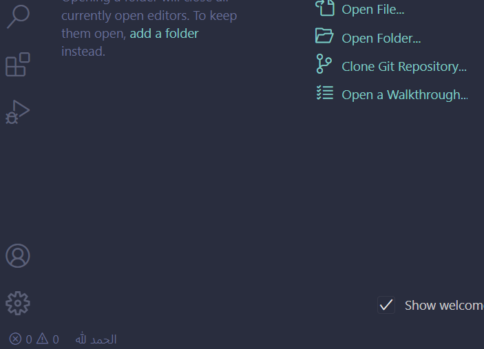
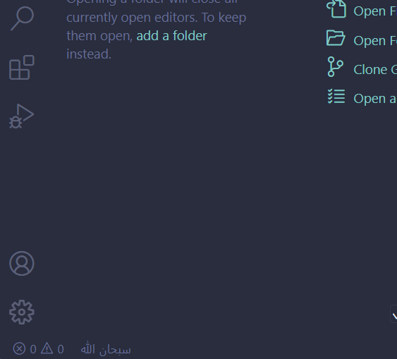

# Azkar README

Simple extension that shows Islamic azkar at the bottom left of your VS Code statusbar.

## Features

The statusbar text loops through multiple Azkar every 5 seconds

## Setup

After downloading the extension, the Zikr should be in the bottom left of your VS Code

## Known Issues

Toggle language is coming soon with the Azkar showing in different languages

## Release Notes

Users appreciate release notes as you update your extension.

### 1.0.0

Azkar showing in Arabic and changing every 5 seconds

